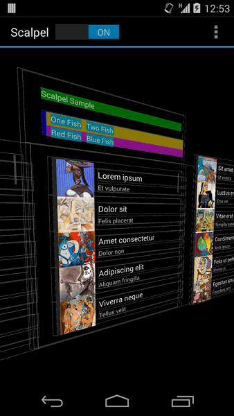

Scalpel
======

DEPRECATED! Android Studio 4.0's layout inspector now includes a live-updating 3D view. Use it!

---

A surgical debugging tool to uncover the layers under your app.




Usage
-----

Place a `ScalpelFrameLayout` at the root of your hierarchy.

 * Enable the 3D interaction with `setLayerInteractionEnabled(boolean)`.
 * Toggle wireframe display with `setDrawViews(boolean)`.
 * Toggle view ID display with `setDrawIds(boolean).`
 * Change the wireframe color with `setChromeColor(int)` and `setChromeShadowColor(int)`.

When interaction is enabled the following gestures are supported:

 * Single touch: Controls the rotation of the model.
 * Two finger vertical pinch: Adjust zoom.
 * Two finger horizontal pinch: Adjust layer spacing.

If you are using the Gradle-based build system, you can wrap this view group around your activity
layouts only in the debug builds.

*Note: There are known text rendering issues prior to Android 4.4 that cannot be fixed. Sorry.*


Download
--------

Download [the latest JAR][1] or grab via Gradle:
```groovy
compile 'com.jakewharton.scalpel:scalpel:1.1.2'
```
or Maven:
```xml
<dependency>
  <groupId>com.jakewharton.scalpel</groupId>
  <artifactId>scalpel</artifactId>
  <version>1.1.2</version>
</dependency>
```


License
--------

    Copyright 2014 Jake Wharton

    Licensed under the Apache License, Version 2.0 (the "License");
    you may not use this file except in compliance with the License.
    You may obtain a copy of the License at

       http://www.apache.org/licenses/LICENSE-2.0

    Unless required by applicable law or agreed to in writing, software
    distributed under the License is distributed on an "AS IS" BASIS,
    WITHOUT WARRANTIES OR CONDITIONS OF ANY KIND, either express or implied.
    See the License for the specific language governing permissions and
    limitations under the License.


 [1]: http://repository.sonatype.org/service/local/artifact/maven/redirect?r=central-proxy&g=com.jakewharton.scalpel&a=scalpel&v=LATEST
